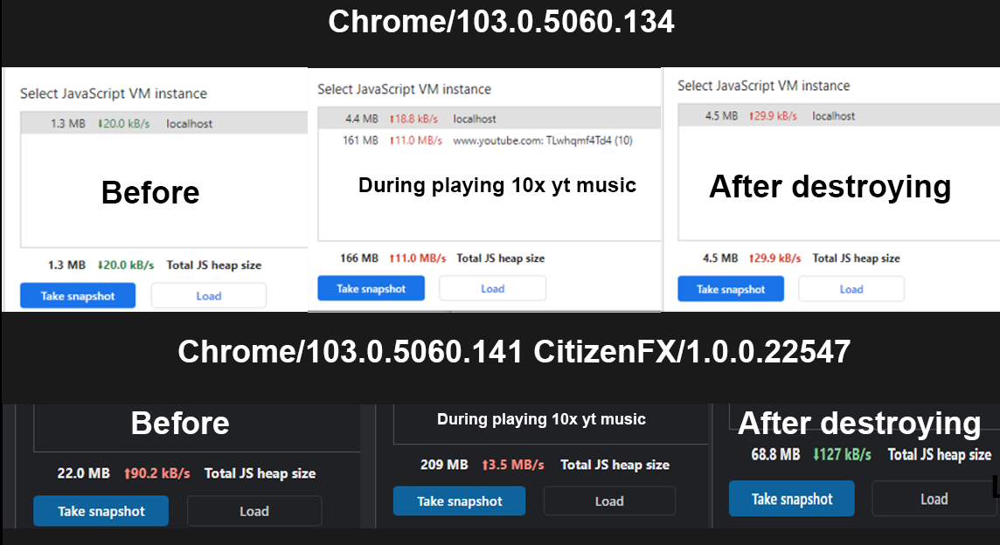

Due to recent changes on YouTube end, there appears to be a significant memory leak.

This is a temporary "fix" that will at least prevent the main browser HUD, etc. from crashing.

It creates a separate DUI, so any potential crash is isolated to its own environment and wont disconnect other web services or hide the HUD.

I did some testing with proper creation and cleanup/destroy methods, but the issue seems to be isolated to FiveM. It is likely related to the new YouTube animation features and the UI.

https://support.google.com/youtube/thread/380540176/new-visual-updates-for-youtube-a-more-expressive-and-intuitive-experience-%E2%9C%A8?hl=en

I downloaded Chromium to run some tests. My standalone version was mostly fine not a huge gap between original vs. after usage, but in the 141 FiveM version, the gap is massive.

I also compared this with my older tests from before the YouTube UI update. It showed a small deviation back then as well, but it was manageable and didnt cause players to crash after just a few songs.

